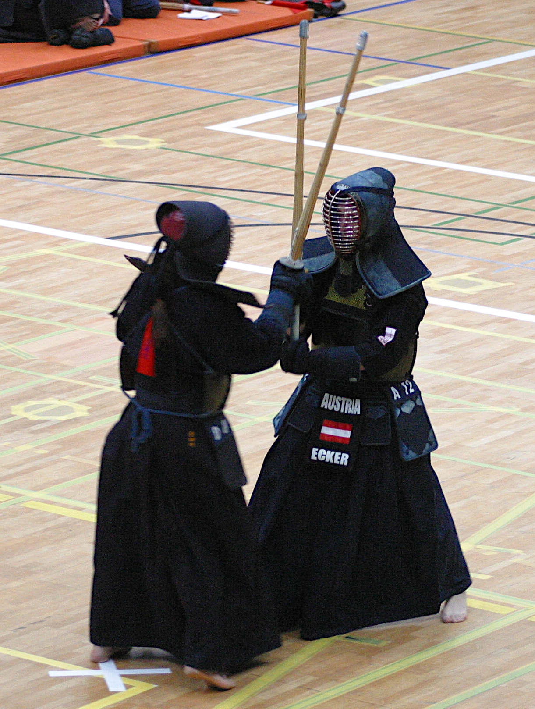
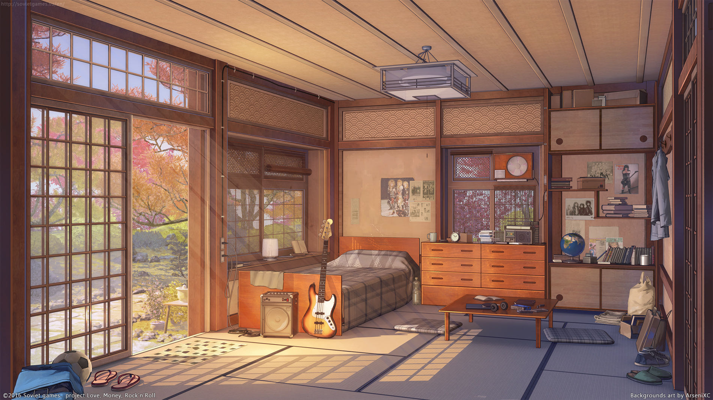

# This is Amy's Website for Self-introduction

Hi everyone, this is Amy and I generally made this website for introducing myself. There are several sections for my introduction: [my pronouns and current situation](#my-pronouns-and-current-situation), [my hobbies](#my-hobbies), [my room](#my-room) and [my academic experience](#my-academic experience). 

Here is my self-portrait:

## My Pronouns and Current Situation 

This is Amy, I use she, her, hers pronouns. I am currently a graduate student studying at [Mailman School of Public Health](https://www.publichealth.columbia.edu). My program is [master of science in Epidemiology](https://www.publichealth.columbia.edu/academics/degrees/master-science/epidemiology).

## My Hobbies {.tabset}

### Kendo 

I love playing [kendo](https://en.wikipedia.org/wiki/Kendo) and it trains my body and makes me healthy. 

### Flower Arrangement  

I also like flower arrangement for building my sense of aesthetics. I have learned the class called [SOGETSU IKEBANA](https://www.sogetsu.or.jp/e/). 

## My Room  

Here's my room: 

## My Academic Experience

[Academic Experience](academic.html)

